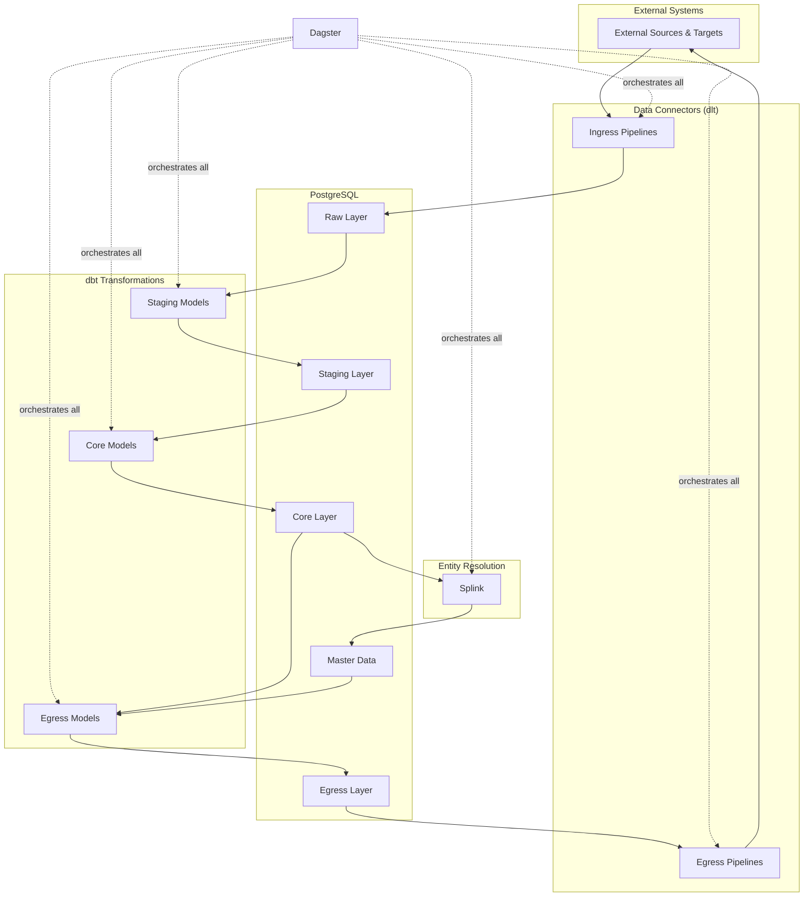

# Data Platform Monorepo Architecture

## Core Concept
Each project is **completely self-contained** with its own:
- `pyproject.toml` at the project root
- Python version (via `.python-version` or pyproject.toml)
- Virtual environment (`.venv/`)
- Dependencies and lock file (`uv.lock`)

When you `cd` into any project, UV automatically detects and uses that project's environment.

## Monorepo Structure

```
mono-repo/
├── .devcontainer/              # VS Code dev container setup
│   ├── devcontainer.json
│   ├── Dockerfile.devcontainer
│   ├── .zshrc
│   └── .p10k.zsh
│
├── .github/                    # GitHub Actions
│   └── workflows/
│       └── ci.yml
│
├── .gitignore
├── README.md
├── ARCHITECTURE.md             # This document
├── Makefile                    # Global commands
│
├── infrastructure/             # Non-Python infrastructure
│   ├── docker/
│   │   ├── postgres-compose.yml
│   │   └── init-scripts/
│   │       └── postgres/
│   ├── kubernetes/
│   └── terraform/
│
├── scripts/                    # Global utility scripts
│   ├── setup-all.sh
│   ├── test-all.sh
│   ├── postgres-init.sql
│   └── seed_postgres.py
│
├── docs/
│   └── guides/
│
└── application/                # All application code
    ├── orchestration/          # Dagster Project
    │   ├── pyproject.toml     # Python 3.11
    │   ├── .python-version
    │   ├── uv.lock
    │   ├── .venv/
    │   ├── README.md
    │   ├── dagster.yaml
    │   ├── workspace.yaml
    │   ├── orchestration/     # Package source
    │   │   ├── __init__.py
    │   │   ├── assets/
    │   │   ├── jobs/
    │   │   ├── resources/
    │   │   ├── schedules/
    │   │   └── sensors/
    │   └── tests/
    │
    ├── data-connectors/        # dlt-based data movement
    │   ├── ingress/           # Data ingress (into PostgreSQL)
    │   │   ├── pyproject.toml # Python 3.10
    │   │   ├── .python-version
    │   │   ├── uv.lock
    │   │   ├── .venv/
    │   │   ├── README.md
    │   │   ├── ingress/       # Package source
    │   │   │   ├── __init__.py
    │   │   │   ├── sources/
    │   │   │   ├── pipelines/
    │   │   │   └── destinations/
    │   │   └── tests/
    │   │
    │   └── egress/            # Data egress (from PostgreSQL)
    │       ├── pyproject.toml # Python 3.10
    │       ├── .python-version
    │       ├── uv.lock
    │       ├── .venv/
    │       ├── README.md
    │       ├── egress/        # Package source
    │       │   ├── __init__.py
    │       │   ├── sources/
    │       │   ├── pipelines/
    │       │   └── destinations/
    │       └── tests/
    │
    ├── transformation/         # dbt Project (PostgreSQL)
    │   ├── pyproject.toml     # Python 3.11
    │   ├── .python-version
    │   ├── uv.lock
    │   ├── .venv/
    │   ├── README.md
    │   ├── dbt_project.yml
    │   ├── profiles.yml
    │   ├── models/
    │   │   ├── ingress/       # Transformations for ingressed data
    │   │   │   ├── staging/
    │   │   │   ├── cleansing/
    │   │   │   ├── conforming/
    │   │   │   └── enrichment/
    │   │   ├── core/          # Core business logic
    │   │   │   ├── dimensions/
    │   │   │   ├── facts/
    │   │   │   └── aggregates/
    │   │   └── egress/        # Transformations for egress
    │   │       ├── denormalized/
    │   │       ├── api_models/
    │   │       ├── reporting/
    │   │       └── reverse_etl/
    │   ├── macros/
    │   ├── seeds/
    │   └── tests/
    │
    ├── entity-resolution/      # Splink Project
    │   ├── pyproject.toml     # Python 3.10
    │   ├── .python-version
    │   ├── uv.lock
    │   ├── .venv/
    │   ├── README.md
    │   ├── entity_resolution/ # Package source
    │   │   ├── __init__.py
    │   │   ├── models/
    │   │   ├── settings/
    │   │   └── backends/
    │   └── tests/
    │
    ├── reporting/              # Lightdash/dbt Project
    │   ├── pyproject.toml     # Python 3.11
    │   ├── .python-version
    │   ├── uv.lock
    │   ├── .venv/
    │   ├── README.md
    │   ├── dbt_project.yml
    │   ├── profiles.yml
    │   ├── models/
    │   ├── macros/
    │   ├── dashboards/
    │   └── tests/
    │
    ├── research/               # Research/Notebooks Project
    │   ├── pyproject.toml     # Python 3.12
    │   ├── .python-version
    │   ├── uv.lock
    │   ├── .venv/
    │   ├── README.md
    │   ├── notebooks/
    │   ├── experiments/
    │   └── outputs/
    │
    └── shared-lib/             # Shared Library
        ├── pyproject.toml     # Python 3.10+
        ├── .python-version
        ├── uv.lock
        ├── .venv/
        ├── README.md
        ├── shared_lib/        # Package source
        │   ├── __init__.py
        │   ├── postgres/
        │   ├── monitoring/
        │   └── utils/
        └── tests/
```

## Data Flow Architecture



## dbt Transformation Layers

### Ingress Transformations
Process and prepare incoming data for core business logic:
- **staging/**: Raw to staging transformations
- **cleansing/**: Data quality rules and cleaning
- **conforming/**: Standardize formats, codes, and structures
- **enrichment/**: Add derived fields before core processing

### Core Transformations
Core business logic and analytics:
- **dimensions/**: Slowly changing dimensions
- **facts/**: Business events and transactions
- **aggregates/**: Pre-computed metrics

### Egress Transformations
Prepare data for external consumption:
- **denormalized/**: Flattened views for easier consumption
- **api_models/**: Optimized for API performance
- **reporting/**: Report-specific structures
- **reverse_etl/**: Format for operational system updates

## Project Configurations

### Orchestration Project (`application/orchestration/pyproject.toml`)
```toml
[project]
name = "orchestration"
version = "0.1.0"
description = "Dagster orchestration for data platform"
requires-python = ">=3.11,<3.12"
dependencies = [
    "dagster>=1.5.0",
    "dagster-webserver>=1.5.0",
    "psycopg2-binary>=2.9.0",
    "pandas>=2.0.0",
    "pydantic>=2.0.0",
]

[project.optional-dependencies]
dev = [
    "pytest>=7.0.0",
    "pytest-cov>=4.0.0",
    "black>=23.0.0",
    "ruff>=0.1.0",
    "mypy>=1.0.0",
]
```

### Ingress Project (`application/data-connectors/ingress/pyproject.toml`)
```toml
[project]
name = "data-ingress"
version = "0.1.0"
description = "Data ingress pipelines - external to PostgreSQL"
requires-python = ">=3.10,<3.11"
dependencies = [
    "dlt[postgres]>=0.4.0",
    "psycopg2-binary>=2.9.0",
    "pandas>=2.0.0",
    "python-dotenv>=1.0.0",
]

[project.optional-dependencies]
dev = [
    "pytest>=7.0.0",
    "black>=23.0.0",
    "ruff>=0.1.0",
]
```

### Egress Project (`application/data-connectors/egress/pyproject.toml`)
```toml
[project]
name = "data-egress"
version = "0.1.0"
description = "Data egress pipelines - PostgreSQL to external"
requires-python = ">=3.10,<3.11"
dependencies = [
    "dlt[postgres]>=0.4.0",
    "psycopg2-binary>=2.9.0",
    "pandas>=2.0.0",
    "python-dotenv>=1.0.0",
]

[project.optional-dependencies]
dev = [
    "pytest>=7.0.0",
    "black>=23.0.0",
    "ruff>=0.1.0",
]
```

### Transformation Project (`application/transformation/pyproject.toml`)
```toml
[project]
name = "transformation"
version = "0.1.0"
description = "Data transformations on PostgreSQL using dbt"
requires-python = ">=3.11,<3.12"
dependencies = [
    "dbt-postgres>=1.7.0",
    "psycopg2-binary>=2.9.0",
    "pandas>=2.0.0",
    "pyyaml>=6.0.0",
]

[project.optional-dependencies]
dev = [
    "pytest>=7.0.0",
    "sqlfluff>=3.0.0",  # SQL linting
]
```

## Development Workflow

### Quick Start
```bash
# 1. Setup all projects
make setup-all

# 2. Start PostgreSQL locally
make postgres-local
make postgres-init
make postgres-seed

# 3. Work on specific project
cd application/transformation
uv sync
uv run dbt debug
uv run dbt run

# 4. Work on data connectors
cd application/data-connectors/ingress
uv sync
uv run python -m ingress.main

cd ../egress
uv sync
uv run python -m egress.main
```

### UV Workflow Benefits
```bash
# Each directory has its own Python environment
cd application/orchestration
python --version  # 3.11

cd ../data-connectors/ingress
python --version  # 3.10

cd ../../research
python --version  # 3.12

# No manual activation needed - UV handles it!
```

## dbt Configuration

### Project Configuration (`application/transformation/dbt_project.yml`)
```yaml
name: 'data_transformation'
version: '0.1.0'
profile: 'postgres_transform'

model-paths: ["models"]
analysis-paths: ["analyses"]
test-paths: ["tests"]
seed-paths: ["seeds"]
macro-paths: ["macros"]
snapshot-paths: ["snapshots"]

models:
  data_transformation:
    staging:
      +materialized: view
      +schema: staging
    
    marts:
      core:
        +materialized: table
        +schema: analytics
      
      egress:
        +materialized: table
        +schema: egress
```

## CI/CD Configuration
```yaml
# .github/workflows/ci.yml
name: CI

on: [push, pull_request]

jobs:
  test:
    strategy:
      matrix:
        project: 
          - application/orchestration
          - application/data-connectors/ingress
          - application/data-connectors/egress
          - application/transformation
          - application/entity-resolution
          - application/reporting
          - application/research
          - application/shared-lib
    
    runs-on: ubuntu-latest
    
    steps:
      - uses: actions/checkout@v3
      
      - name: Install uv
        uses: astral-sh/setup-uv@v3
      
      - name: Test ${{ matrix.project }}
        run: |
          cd ${{ matrix.project }}
          uv sync
          uv run pytest tests/
          uv run black . --check
          uv run ruff check .
```

## Benefits of This Structure

1. **Clean Root**: Only configuration and documentation at root level
2. **Organized Applications**: All code under `application/` folder
3. **Grouped Data Movement**: Ingress and egress together under `data-connectors/`
4. **Clear Separation**: Infrastructure, scripts, and docs separate from application code
5. **UV Isolation**: Each project maintains its own Python environment
6. **Easy Navigation**: Logical grouping makes finding code easier

This architecture provides a clean, scalable foundation with all application code consolidated under the `application/` directory while keeping configuration and infrastructure at the root level.